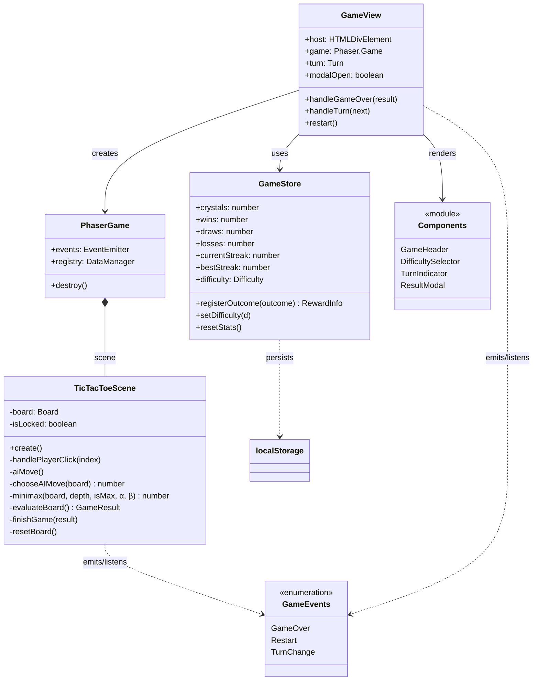
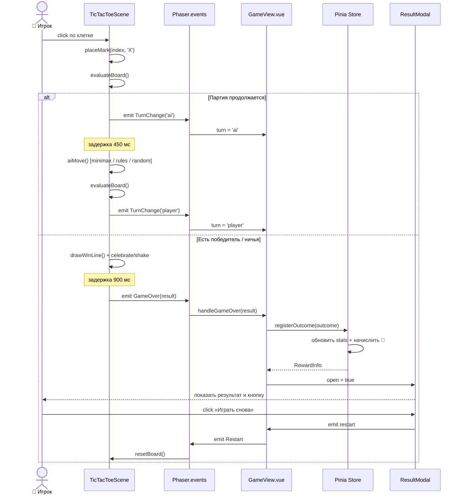

<div align="center">

# ✦ Крестики-Нолики · Neon Arena ✦

**Неоновая аркадная версия классики с тремя уровнями ИИ, кристаллами, сериями побед и редкими дропами.**


</div>

---

## 🎮 О проекте

Это не просто крестики-нолики — это **неоновая арена** с визуальными эффектами Phaser, прогрессией игрока и системой наград. Игра полностью работает офлайн, прогресс сохраняется в `localStorage`.

### ✨ Особенности

- 🧠 **Три уровня ИИ** — от случайных ходов до идеального минимакса с alpha-beta отсечением.
- 💎 **Система кристаллов** — награды за победы, ничьи и даже поражения.
- 🎁 **Редкие дропы** — шанс 30% получить бонус к награде за победу.
- 🔥 **Серии побед** — текущая и лучшая серии отслеживаются и сохраняются.
- 📊 **Статистика** — W/D/L, винрейт, всего игр.
- 🎆 **Визуальные эффекты** — частицы, свечение, конфетти, тряска камеры.
- 📱 **Адаптивный дизайн** — одинаково хорош на десктопе и мобильных.
- 🇷🇺 **Русская локализация** с корректной плюрализацией.

---

## 🚀 Быстрый старт

```bash
# Клонировать репозиторий
git clone https://github.com/HorhyDeGuzman/tic-tac-toe.git
cd tic-tac-toe

# Установить зависимости
npm install

# Запустить dev-сервер
npm run dev
```

Откройте `http://localhost:5173` — и вперёд!

### 📦 Production-сборка

```bash
npm run build      # type-check + bundle в dist/
npm run preview    # локальный предпросмотр сборки
```

### 🧰 Требования

- Node.js `^20.19.0` или `>=22.12.0`
- npm

---

## 🧠 Уровни сложности ИИ

| Сложность | Иконка | Стратегия |
|-----------|:------:|-----------|
| **Лёгкая** | 🌱 | Случайные ходы из свободных клеток |
| **Средняя** | ⚔️ | Ищет выигрышный ход → блокирует соперника → предпочитает центр/углы |
| **Сложная** | 🔥 | Minimax с alpha-beta отсечением — **непобедим**, максимум ничья |

---

## 💎 Экономика наград

| Исход | Базовая награда | Эффект на серию |
|-------|:---------------:|-----------------|
| 🏆 Победа | **+100 💎** | +1 к текущей серии |
| 🤝 Ничья | **+40 💎** | без изменений |
| 💔 Поражение | **+15 💎** | серия обнуляется |

> 🎁 **Редкий дроп:** с шансом **30%** при победе дополнительно выпадает *Rare Crystal Pack* **+50 💎**.

---

## 🛠 Стек технологий

| Слой | Технология |
|------|-----------|
| Фреймворк | **Vue 3** (Composition API, `<script setup>`) |
| Язык | **TypeScript 6** |
| Сборка | **Vite 8** |
| Состояние | **Pinia 3** + персист в `localStorage` |
| Игровой движок | **Phaser 4** — рендер доски, частицы, анимации |
| Стили | Scoped CSS, неоновая палитра |

---

## 📁 Структура проекта

```
src/
├── App.vue                     # корневой компонент
├── main.ts                     # точка входа, подключение Pinia
├── views/
│   └── GameView.vue            # мост между Phaser и Vue
├── components/
│   ├── GameHeader.vue          # шапка со статистикой и кристаллами
│   ├── DifficultySelector.vue  # выбор сложности
│   ├── TurnIndicator.vue       # индикатор «чей ход»
│   └── ResultModal.vue         # модалка результата с наградой
├── game/
│   ├── createGame.ts           # конфигурация Phaser.Game
│   ├── TicTacToeScene.ts       # сцена: доска, ИИ, эффекты
│   ├── constants.ts            # размеры, цвета, награды
│   └── types.ts                # типы, события, ключи registry
├── stores/
│   └── game.ts                 # Pinia store + persist
└── utils/
    └── plural.ts               # русская плюрализация
```

---

## 🔄 Архитектура и взаимодействие

Vue и Phaser общаются через **события игры** (`game.events`) и **registry** (`game.registry`).

- **`GameEvents.GameOver`** — сцена сообщает об итоге партии → Vue начисляет награду и открывает модалку.
- **`GameEvents.TurnChange`** — обновляет `TurnIndicator`.
- **`GameEvents.Restart`** — Vue просит сцену сбросить доску.
- **`RegistryKeys.Difficulty`** — Vue пишет выбранную сложность в Phaser registry.

Прогресс (кристаллы, W/D/L, серии, сложность) сохраняется в `localStorage` под ключом `tictactoe:state:v1`.

### 🧩 Диаграмма классов (UML)



### ⏱ Последовательность одного хода (Sequence)



---

## 🎨 Палитра

| Элемент | Цвет |
|---------|:----:|
| Фон | `#07091a` |
| Сетка (свечение) | `#5865f2` |
| X (игрок) | `#00e5ff` |
| O (ИИ) | `#ff3db0` |
| Линия победы | `#ffe066` |

---

## 📜 Скрипты npm

| Команда | Назначение |
|---------|-----------|
| `npm run dev` | Dev-сервер с HMR |
| `npm run build` | Type-check + production-сборка |
| `npm run build-only` | Сборка без type-check |
| `npm run type-check` | Проверка типов через `vue-tsc` |
| `npm run preview` | Локальный предпросмотр `dist/` |

---

## 📄 Лицензия

MIT — используйте, форкайте, улучшайте.

---

<div align="center">

Сделано с 💎 и ⚡ на Vue + Phaser

</div>
